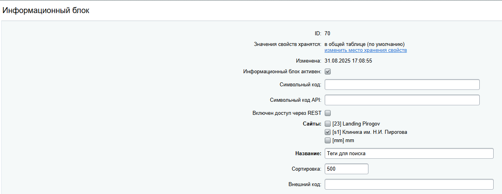
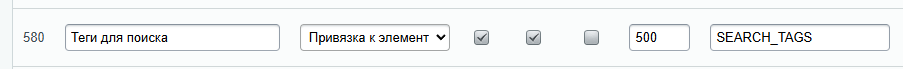
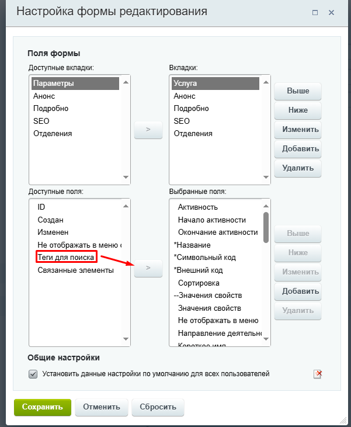
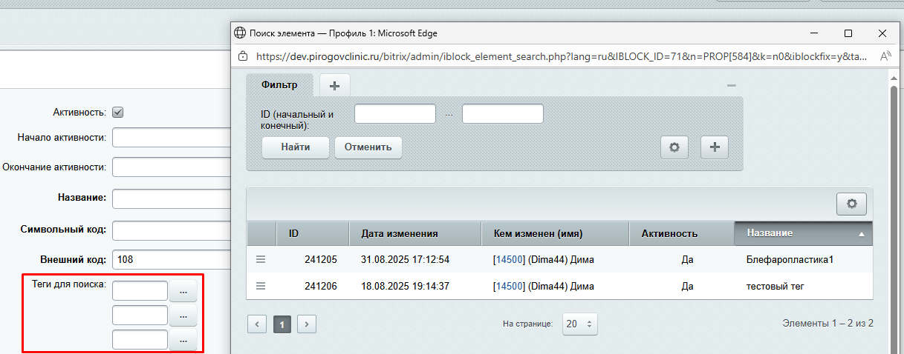

Привет, народ! Сюда я буду выкладывать различные лайфхаки и готовые решения для битрикса. Надеюсь, Вам будет интересно и полезно)

# 1. Инфоблок тегов для умного поиска
Бывают ситуации, когда стандартного поиска недостаточно — пользователи ищут товары или статьи по словам, которых нет в основном контенте. Решение: создаем собственные поисковые теги в виде элементов инфоблока, которые расширяют поисковую выдачу.
## Что мы получим:
+ Гибкие теги — любые слова-синонимы для поиска
+ Морфологию "в обход" — работаем со сложными названиями и ошибками
+ Централизованное управление — меняем теги — автоматически обновляется поиск
## Быстрый старт:
### Шаг 1: Создаем инфоблок тегов
+ Переходим в "Типы инфоблоков" → создаем новый

+ Называем понятно, например "Поисковые теги"
+ Важно! Используем поля:
+ PREVIEW_TEXT — основные слова через запятую
+ DETAIL_TEXT — дополнительные синонимы

### Шаг 2: Добавляем свойство в целевые инфоблоки
+ Создаем свойство типа "Привязка к элементам"
+ Код свойства: SEARCH_TAGS
  
+ Название: "Поисковые теги"
+ Привязываем свойство к инфоблоку наших тегов

+ В элементе инфоблока выполняем настройки для отображения нового свойства

+ Теперь мы можем прикрепить необходимые в нужный элемент

## Настройка логики
А вот сейчас будет самое интересное - создание логики для индексации связанных элементов. Мы будем использовать событие __BeforeIndex__, которое срабатывает перед переиндексацией элемента.
Функции, отрабатывающие по событиям, необходимо регистрировать в init.php.

```plaintext
корневая директория/
├── 📁 local/           
    ├── 📁 php_interface/   
       ├── init.php     #регистрируем обработчики тут

```
Хорошим тоном будет писать всю кастомизацию в директории __local__
1. Обработчик для расширения поиска
```php
AddEventHandler("search", "BeforeIndex", "ModifySearchContentWithTags");
```

2.  Теперь напишем саму функцию __ModifySearchContentWithTags__, которая будет срабатывать по событию перед индексацией
```php
function ModifySearchContentWithTags($arFields)
{
//Укажем, что нас интересует именно модуль инфоблоков
    if ($arFields["MODULE_ID"] == "iblock") {
        $elementId = $arFields["ITEM_ID"];
        // Получаем индексируемый элемент по его ID
        $element = CIBlockElement::GetByID($elementId)->Fetch();

        if (!$element) return $arFields;

// Получаем свойство SEARCH_TAGS 
        $tagsProperty = CIBlockElement::GetProperty(
                $element["IBLOCK_ID"],
                $element["ID"],
                array(),
                array("CODE" => "SEARCH_TAGS")
        );

// Создаем массив слов, по которым будет происходить индексация
        $tagWords = [];
        while ($tag = $tagsProperty->Fetch()) {
            if (!empty($tag["VALUE"])) {
                $tagElement = CIBlockElement::GetByID($tag["VALUE"])->Fetch();
                if ($tagElement && !empty($tagElement["PREVIEW_TEXT"]) || $tagElement && !empty($tagElement["DETAIL_TEXT"])) {
                    // в переменную $fullText присваиваем все слова, которые хранятся в свойствах
                    // PREVIEW_TEXT и DETAIL_TEXT, разделенные запятыми
                    $fullText = $tagElement["PREVIEW_TEXT"] . " " . $tagElement["DETAIL_TEXT"];
                    $words = array_map('trim', explode(",", $fullText));
                    $tagWords = array_merge($tagWords, $words);
                }
            }
        }
// Добавляем слова в тело документа, которое будет проиндексировано модулем поиска
        if (!empty($tagWords)) {
            $arFields["BODY"] .= " " . implode(" ", $tagWords);
        }
    }
    
    // Можем вывести результат функции в search_debug.log в корне сайта
    file_put_contents(
            $_SERVER["DOCUMENT_ROOT"] . "/search_debug.log",
            date("Y-m-d H:i:s") . "\n" .
            "Содержимое:\n" . print_r($arFields, true) . "\n" .
            "Element:\n" . print_r($element, true) . "\n" .
            "tagwords:\n" . print_r($tagWords, true) . "\n" .
            "----------------------------------------\n",

    );

    return $arFields;
}
```
Теперь элементы, в которых есть связанное свойство тегов, будут попадать в поисковую выдачу. Разумеется, после индексации)
Но тут появляется одно серьезное "__НО__" - элемент с тегами индексируется в момент его изменения. А если мы захотим поменять слова в тегах?
Неужели нужно будет проводить полную переиндексацию или вручную индексировать каждый элемент?
Конечно же нет. Если возможно - автоматизируй) 
Нам понадобится еще одна функция, которая будет проводить переиндексацию при редактировании элементов самих тегов поиска.

3.  Напишем функцию переиндексации связанных элементов при изменении самих тегов
Мы будем использовать события ___OnAfterIBlockElementAdd___ и ___OnAfterIBlockElementUpdate___. Больше всего нас интересует OnAfterIBlockElementUpdate, потому что именно это событие
отрабатывает после сохранения изменений в элементе тега.

```php
AddEventHandler("iblock", "OnAfterIBlockElementAdd", "ForceReindexForTaggedElements");
AddEventHandler("iblock", "OnAfterIBlockElementUpdate", "ForceReindexForTaggedElements");
```

А вот и сама функция: 
```php
function ForceReindexForTaggedElements(&$arFields)
{
    $TAGS_IBLOCK_ID = 70; // сюда мы жестко прописываем ID инфоблока тегов

    // Работаем только с элементами-тегами
    if ($arFields["IBLOCK_ID"] != $TAGS_IBLOCK_ID) return;

    // Находим все элементы, где привязан этот тег
    $rsElements = CIBlockElement::GetList(
            array(),
            array(
                    "PROPERTY_SEARCH_TAGS" => $arFields["ID"], // Элементы с этим тегом
                    "ACTIVE" => "Y" // Смотрим по активным
            ),
            false,
            false,
            array("ID", "IBLOCK_ID", "IBLOCK_TYPE", "NAME", "PREVIEW_TEXT", "DETAIL_TEXT", "TIMESTAMP_X", "PERMISSIONS", "SITE_ID", "MODULE_ID")
    );

    while ($element = $rsElements->Fetch()) {
        // 1. Получаем полные данные элемента по его ID
        $fullElement = CIBlockElement::GetByID($element["ID"])->Fetch();

        // 2. Сформируем данные для индекса
        $searchData = array(
                "TITLE" => $fullElement["NAME"],
                "BODY" => strip_tags($fullElement["PREVIEW_TEXT"] . " " . $fullElement["DETAIL_TEXT"]),
                "ITEM_ID" => $fullElement["ID"],
                "PARAM1" => $fullElement["IBLOCK_TYPE_ID"],
                "PARAM2" => $fullElement["IBLOCK_ID"],
                "SITE_ID" => $fullElement["LID"],
        );

        // 3. Получаем все теги, которые мы привязали к элементу
        
        $tagsProperty = CIBlockElement::GetProperty(
                $fullElement["IBLOCK_ID"],
                $fullElement["ID"],
                array(),
                array("CODE" => "SEARCH_TAGS")
        );

        $tagContents = [];
        while ($tag = $tagsProperty->Fetch()) {
            if (!empty($tag["VALUE"])) {
                $tagElement = CIBlockElement::GetByID($tag["VALUE"])->Fetch();
                if ($tagElement && !empty($tagElement["PREVIEW_TEXT"])) {
                    $tagContents[] = $tagElement["PREVIEW_TEXT"];
                } else if ($tagElement && !empty($tagElement["DETAIL_TEXT"])) {
                    $tagContents[] = $tagElement["DETAIL_TEXT"];
                }
            }
        }

        // 4. Добавляем теги в BODY для 
        if (!empty($tagContents)) {
            $searchData["BODY"] .= " " . implode(" ", $tagContents);
        }

        // 5. Переиндексация. Ниже 2 способа вызвать переиндексацию, но едва ли в них есть принципиальная разница
//        $search = new CSearch();
//        $search->DeleteIndex($fullElement["ID"], "iblock");
//        $search->Index("iblock", $fullElement["ID"], $searchData, true);
        CSearch::Index("iblock", $fullElement["ID"], $searchData, true);


        // Выводим логи в файл
        file_put_contents(
                $_SERVER["DOCUMENT_ROOT"] . "/search_reindex.log",
                date("Y-m-d H:i:s") . " | Элемент ID: " . $fullElement["ID"] . "\n" .
                "Количество тегов: " . count($tagContents) . "\n" .
                "Длина BODY: " . strlen($searchData["BODY"]) . "\n" .
                "Содержимое searchData:\n" . print_r($searchData, true) . "\n" . 
                "Содержимое fullElementID:\n" . print_r($fullElement, true) . "\n" .
                "----------------------------------------\n",

        );
    }
}
```
Вот собственно и все. Данный метод будет актуален для сложных названий, которые посетители сайта пишут с ошибками и штатная морфология не справляется)
По итогу мы имеем: 
+ Умный поиск — находим по синонимам и частым ошибкам
+ Автообновление — меняем тег → обновляется поиск по всем связанным элементам
+ Гибкость — один тег для множества элементов
+ Логирование — всегда видим что происходит во время выполнения функций. На проде логирование лучше отключить) 